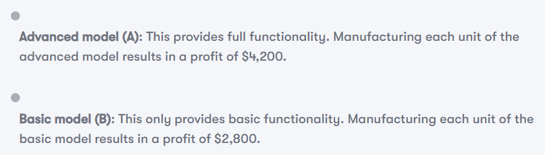
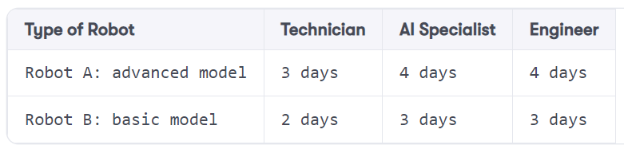
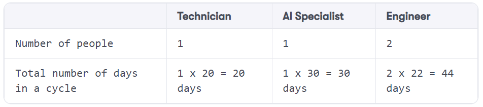
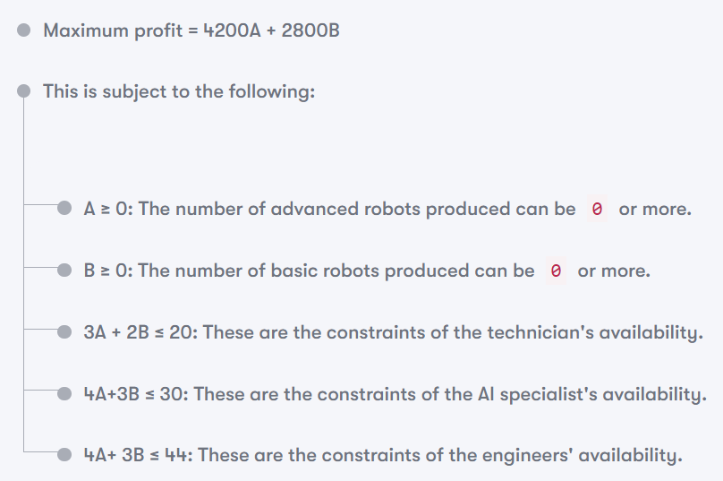

# master-linear-programming
Master Linear Programming

## ✅ Setup Env
- Create Python environment\
`conda create -n env_name python=3.10`\
`conda activate env_name`
- Create Python environment\
`pip install -r .\path_to_requirements\requirements.txt`

## ✅ Linear Programming
The basic algorithm behind linear programming was developed by George Dantzig 
at the University of California at Berkeley in the early 1940s. 
Dantzig used this concept to experiment with logistical supply-and-capacity planning
for troops while working for the US Air Force. At the end of the Second World War, 
Dantzig started working for the Pentagon and matured his algorithm into 
a technique that he named linear programming. 
It was used for military combat planning.

Today, it is used to solve important real-world problems that relate to 
minimizing or maximizing a variable based on certain constraints. 
Some examples of these problems are as follows:
- Minimizing the time to repair a car at a mechanic shop based on the resources
- Allocating available distributed resources in a distributed computing environment to minimize response times
- Maximizing the profit of a company based on the optimal assignment of resources within the company

Tree steps to deal with linear programming:
- Formulating a linear programming problem
  - Formulate the problem through a set of equations
  - The variables used in the equation must be linear
- Defining the objective function
- Specifying constraints

Practical application - capacity planning with linear programming:\

